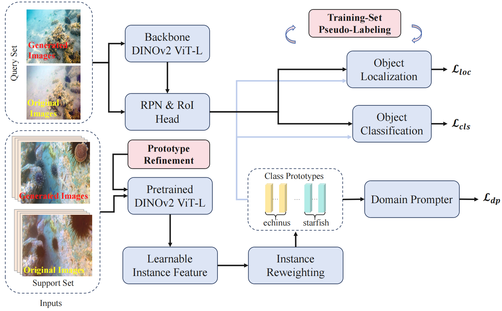
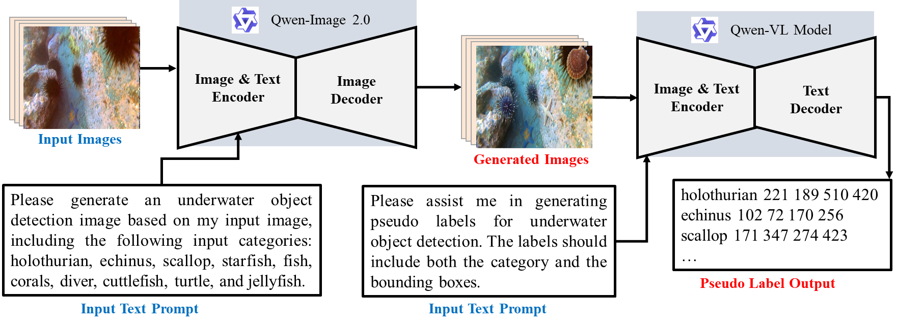

## NTIRE 2026 CD-FSOD Challenge Factsheet AIPR: Data augmentation and Iterative Pseudo-labeling with Prototype Refinement for Cross-Domain Few-Shot Object Detection


<div align="center"></div>


# Datasets
We take **COCO** as source training data and **dataset1**, **dataset2**, **dataset3** as targets. 

Challenge datasets can be found in [NTIRE 2026 Cross-Domain Few-Shot Object Detection (CDFSOD) Challenge](https://www.codabench.org/competitions/12873/)

Here, we utilize the Qwen VL model to expand our target datasets, as illustrated in the figure below.

<div align="center"></div>

### The generated images, along with the pseudo labels and the original target data, are combined to train our model effectively.

Also, The pre-trained stage on COCO is directly taken from the [CD-ViTO]([https://github.com/mlzxy/devit](https://github.com/lovelyqian/CDFSOD-benchmark)), thus in practice, only the targets are needed to run our experiments.  

The target datasets could be easily downloaded in the following links:  (If you use the datasets, please cite them properly, thanks.)

- [Data augmentation datasets Link](https://pan.baidu.com/s/1EcE5vMqr7Kp1Bp2lYztxmA?pwd=2ibp)

# Methods
## Setup
An anaconda environment is suggested, take the name "cdfsod" as an example: 

```
git clone git@github.com:zhimengXin/CD-FSOD-Challenge.git
cd CD-FSOD-Challenge
conda create -n cdfsod python=3.9
conda activate cdfsod
pip install -r requirements.txt 
pip install -e .
```

## Run 
1. Download weights:
- download pretrained model from [DE-ViT](https://github.com/mlzxy/devit/blob/main/Downloads.md).

- You could also download pretrained model from Baidu Netdisk: https://pan.baidu.com/s/1ucod5uGGvbZQEtC3PbgevA?pwd=nvtx 提取码: nvtx. And you need to construct the weights like devit.

2. Prototypes generated: 
```
bash build_prototypes.sh
```

3. If you are using dataset2, please run: 
```
bash pseudo_loop.sh
```


## Run Our model
Add --controller to main_results.sh, then
```
bash main_results.sh
```

Our trained model can be found in this [Link](https://pan.baidu.com/s/1EcE5vMqr7Kp1Bp2lYztxmA?pwd=2ibp)

# Citation
If you find our paper or this code useful for your research, please considering cite us (●°u°●)」:
```
```
  


